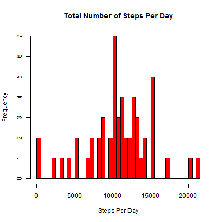
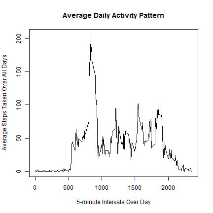
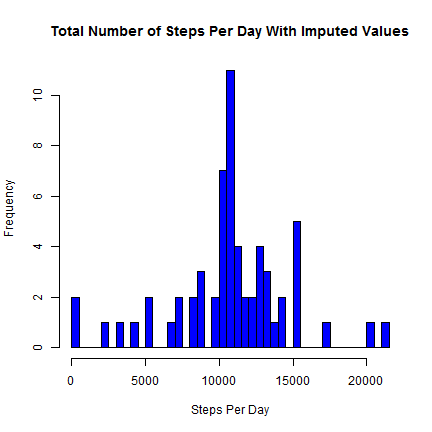
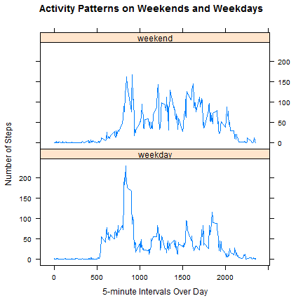

# Reproducible Research: Peer Assessment 1

## Loading and preprocessing the data


```r
    ## unzip the data set
    unzip("activity.zip")
    
    # read the data
    data <- read.csv("activity.csv")
```

## What is mean total number of steps taken per day?


```r
    # total steps for each day
    steps.per.day <- aggregate(steps~date, data=data, FUN=sum)
```

```r
    # histogram for each day
    hist(steps.per.day$steps, breaks=nrow(steps.per.day), main="Total Number of Steps Per Day",
         xlab="Steps Per Day", col="red")
```

 

```r
    # Mean and median for days
    mean.steps.per.day <- mean(steps.per.day$steps)
    median.steps.per.day <- median(steps.per.day$steps)
```
The mean total number of steps per day is 10766  
The median total number of steps per day is 10765

## What is the average daily activity pattern?


```r
    # Average number of steps  per 5 minute 
    average.per.interval <- aggregate(steps~interval, data=data, FUN=mean)
```

```r
    # Time series plot for the 5-minute interval and  
    # average number of steps
    plot(average.per.interval, type="l", main="Average Daily Activity Pattern",
         xlab="5-minute Intervals Over Day", ylab="Average Steps Taken Over All Days")
```

 

```r
    # 5-minute interval, on average across all the days in the dataset, 
    # that contains the maximum number of steps
    max.interval <- average.per.interval[which.max(average.per.interval$steps),"interval"]
```
5-minute interval, on average-all days, that contains the maximum number of steps is 835

## Imputing missing values

```r
    ## calculate the total number of missing values in the dataset 
    total.missing <- sum(is.na(data))
```
Number of missing values in the dataset is 2304.  
  
The missing values will be imputed by replacing step NAs with the mean of the 5-minute interval averaged across all days.


```r
    # create a vector of steps with NAs replaced by imputed value (mean of 5-minute interval)
    imputed.steps <- numeric()
    for(i in 1:nrow(data)) {
        obs <- data[i,]
        if (is.na(obs$steps)) {
            steps <- subset(average.per.interval,interval==obs$interval)$steps
        } else {
            steps <- obs$steps
        }
        imputed.steps <- c(imputed.steps,steps)
    }
    
     ## create a new dataset that is equal to the original dataset but with the missing data filled in.
    imputed.data <- data
    imputed.data$steps <- imputed.steps
    
    # find the total number of steps taken each day
    imputed.steps.per.day <- aggregate(steps~date, data=imputed.data, FUN=sum)
```

```r
    # make a histogram of the total number of steps taken each day
    hist(imputed.steps.per.day$steps, breaks=nrow(imputed.steps.per.day), 
         main="Total Number of Steps Per Day With Imputed Values",
         xlab="Steps Per Day", col="blue")
```

 

```r
    # Calculate the mean and median total number of steps taken per day
    imputed.mean.steps.per.day <- mean(imputed.steps.per.day$steps)
    imputed.median.steps.per.day <- median(imputed.steps.per.day$steps)
```
The mean total number of steps taken per day is 10766  
The median total number of steps taken per day is 10766

After imputing the missing step values, the mean total number of steps per day remained unchanged while the median total number of steps per day changed from 10765 to 10766. The impact of the imputation was
a slight increase in the median total number of steps per day.

## Are there differences in activity patterns between weekdays and weekends?


```r
    ## change date column from factor to Date
    
    imputed.data$date <- as.Date(imputed.data$date)

    ## create a new factor variable in the dataset with two levels 
    ## "weekday" and "weekend" indicating whether date is a weekday or weekend day.

    weekend.days <- c("Saturday","Sunday")
    imputed.data$daytype <- as.factor(sapply(imputed.data$date, function(x) ifelse(weekdays(x) %in% weekend.days,"weekend","weekday")))
```

```r
    ## Make a panel plot containing a time series plot (i.e. type = "l") 
    ## of the 5-minute interval (x-axis) and the average number of steps taken, 
    ## averaged across all weekday days or weekend days (y-axis).
    require(plyr)
```

```
## Loading required package: plyr
```

```r
    average.steps <- ddply(imputed.data, .(interval, daytype), summarize, steps = mean(steps))

    require(lattice)
```

```
## Loading required package: lattice
```

```r
    xyplot(steps ~ interval | daytype, data = average.steps, layout = c(1, 2), type = "l", 
     xlab="5-minute Intervals Over Day", ylab="Number of Steps",
     main="Activity Patterns on Weekends and Weekdays")
```

 
